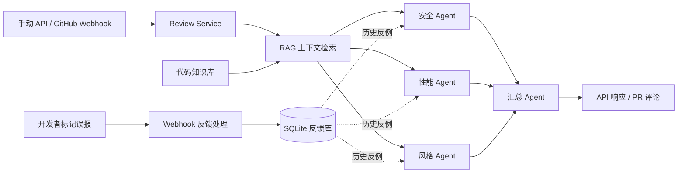

# Code Sentinel：设计与改进

## 1. 项目背景

Code Sentinel 是一个用于实践 Agent 工作流编排的个人项目。它接收代码 Diff，通过多个专职 Agent 分别检查安全、性能和代码风格，最后汇总为一份代码审查报告。

项目同时尝试解决两个常见问题：只看 Diff 容易缺少调用上下文；模型产生误报后，如果系统不记录反馈，同类错误会重复出现。因此，项目加入了代码知识库检索和误报反馈记忆，并通过 GitHub Webhook 将评审流程接入 Pull Request。

这个项目的目标是验证 Agent、工具、状态和外部事件如何组成一条可运行链路，而不是替代成熟的静态分析平台。

## 2. 设计目标

系统主要围绕五个目标设计：

1. **评审职责可拆分**：安全、性能和风格由不同节点处理，避免一个提示词同时承担过多目标。
2. **代码上下文可补充**：在 Diff 之外检索相关代码，减少只看局部变更造成的误判。
3. **流程可以自动触发**：既支持 API 手动提交，也支持 GitHub PR 事件触发并回写评论。
4. **用户反馈可以复用**：把开发者标记的误报保存下来，为后续评审提供反例。
5. **模型接入可以切换**：通过统一工厂创建模型，减少业务节点对具体提供方的依赖。

## 3. 设计过程

### 阶段一：跑通单次代码审查

第一版先实现最小闭环：输入代码 Diff 和语言，调用 LLM 返回审查建议。这个阶段用于确认接口、提示词和模型调用能够正常工作。

### 阶段二：拆分多 Agent 工作流

单一提示词容易把安全、性能和风格问题混在一起，也难以观察每类检查是否执行。因此我使用 LangGraph 建立共享状态，将评审拆成三个专职节点，再由汇总节点去重和整理结果。

### 阶段三：接入 GitHub Webhook

为了让评审进入真实开发流程，系统监听 PR 创建和更新事件，校验 Webhook 签名后读取 Diff、执行审查，并把最终报告写回 Pull Request。手动评审 API 仍然保留，方便独立调试模型和提示词。

### 阶段四：增加 RAG 上下文

只检查 Diff 无法知道被调用函数和类的真实实现。我将仓库代码切分后写入 ChromaDB，在 Agent 执行前根据变更中的函数或类名检索相关片段，并把结果加入评审上下文。

### 阶段五：记录误报反馈

当用户在 PR 评论中标记“误报”或“判断错误”时，系统把代码片段和反馈写入 SQLite。后续评审会读取近期反例，提醒 Agent 避免重复相同判断。这是一种简单的外部记忆机制，用来验证反馈闭环。

## 4. 总体架构

FastAPI 负责入口，LangGraph 负责状态和节点编排，ChromaDB 保存代码索引，GitHub API 负责读取 PR Diff 与回写评论。开发者在 PR 中标记误报后，Webhook 将反馈写入 SQLite；后续评审会把这些记录作为历史反例提供给三个评审 Agent。

## 5. 关键技术决策

### 5.1 使用专职节点而不是单个大提示词

安全、性能和风格检查关注点不同。拆成独立节点后，每个 Agent 可以使用更聚焦的系统提示，输出分别写入共享状态，最后再统一汇总。这样更容易调试某一类评审，也便于以后增加新的检查节点。

### 5.2 用共享状态连接工作流

工作流状态保存 Diff、语言、检索上下文、工具结果和各 Agent 评论。节点只读取所需输入并返回自己的增量结果，汇总节点不需要重新执行前面的分析。

### 5.3 RAG 只提供上下文，不直接给出结论

代码知识库负责找出可能相关的定义和实现，是否存在问题仍由评审节点结合 Diff 判断。检索和推理分开后，可以分别调整切分、召回数量和评审提示词。

### 5.4 用户反馈作为外部记忆

模型参数不会因为一次反馈自动变化，因此系统把误报案例持久化，并在后续请求中作为反例加入提示。这个实现比较轻量，但能够验证“发现误报 → 保存反馈 → 后续参考”的完整路径。

### 5.5 Webhook 入口先验证来源

Webhook 在解析和执行任务前使用共享密钥验证 HMAC 签名，只处理预期的事件类型和动作。这样可以避免任意请求直接触发仓库读取和模型调用。

## 6. 问题解决与改进

### 6.1 单一 Agent 的关注点容易混乱

**问题**：一个提示词同时检查多个维度时，输出重点不稳定，也不容易判断漏掉了哪类检查。

**方案**：拆成安全、性能、风格三个节点并行分析，再由汇总节点去重。

**结果**：各类职责和输出位置更清晰，也能独立修改节点提示词。

### 6.2 只看 Diff 容易产生误报

**问题**：变更代码可能调用仓库中的其他函数，只看当前片段无法判断完整行为。

**方案**：在正式评审前提取函数和类关键词，从代码向量库检索相关片段。

**结果**：Agent 能结合局部变更和仓库上下文给出判断。

### 6.3 同类误报会重复出现

**问题**：用户纠正一次评审后，下一次模型调用并不知道之前的错误。

**方案**：把误报评论、代码片段和用户反馈保存为外部记忆，后续提示中加入近期反例。

**结果**：项目形成了一个可运行的反馈闭环，也为后续升级成相似案例检索保留了接口。

### 6.4 自动触发需要控制入口风险

**问题**：公开 Webhook 如果不验证来源，可能被伪造请求触发模型调用或仓库操作。

**方案**：使用 HMAC 校验请求签名，并过滤不相关的 GitHub 事件。

**结果**：只有符合预期的 PR 和评论事件才进入后台处理流程。

## 7. AI 在项目中的使用方式

AI 主要用于协助设计和实现 Agent 工作流：

- 讨论评审节点的职责和共享状态结构。
- 编写与调整安全、性能、风格及汇总提示词。
- 辅助实现 FastAPI、LangGraph、GitHub API、RAG 和反馈存储代码。
- 根据运行结果分析节点输入输出，继续修改路由和提示词。
- 为异常路径、测试样例和后续改进提供建议。

我的工作重点是确定项目范围、拆分工作流、选择组件、验证实际行为并判断哪些建议应该进入系统。整个过程采用“小范围实现 → 运行观察 → 反馈修改”的方式，而不是一次生成全部代码。

## 8. 验证方式与当前限制

当前仓库提供了图工作流和 RAG 检索的手动验证脚本，可以检查节点执行、状态合并及知识库召回。Webhook 路径可以通过带有效签名的测试请求验证事件过滤和任务触发，Docker Compose 用于检查服务与持久化目录的基本运行方式。

作为个人实践项目，目前仍有以下改进空间：

- 将手动验证脚本整理为不依赖真实模型密钥的自动化测试。
- 对大 Diff 进行按文件和 token 预算切分，避免简单截断丢失重要变更。
- 将汇总文本升级为结构化评论，支持文件名和行号定位。
- 把用户反馈与真实的原始 AI 评论准确关联，再按相似度检索历史误报。
- 为 Webhook 后台任务增加持久队列、幂等控制、重试和可观测性。
- 完善多语言代码索引、增量更新和检索质量评估。

这些限制也构成项目下一阶段的实践方向：在保持工作流清晰的基础上，继续提高评审结果的准确性、可验证性和工程可靠性。
